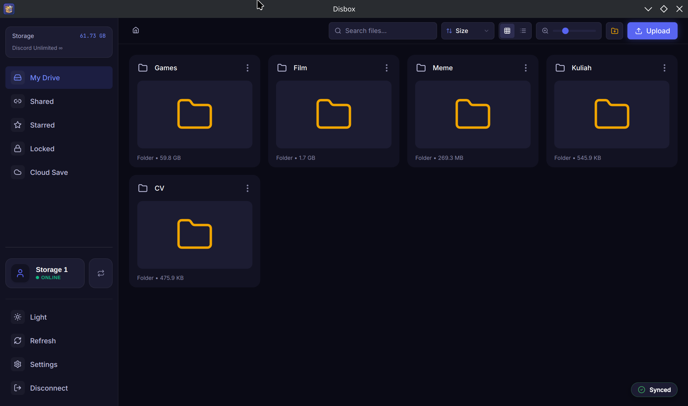
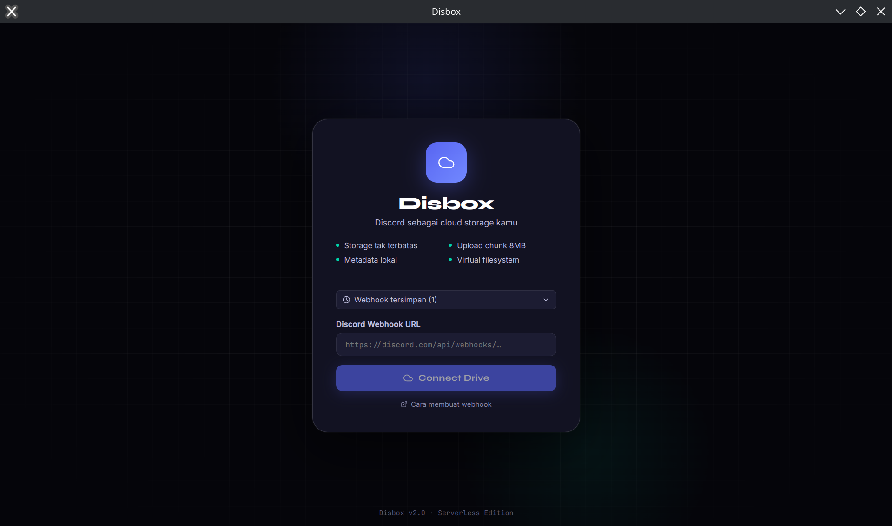
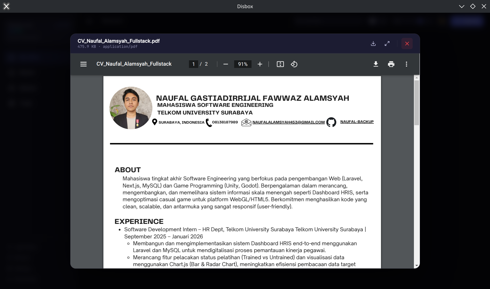
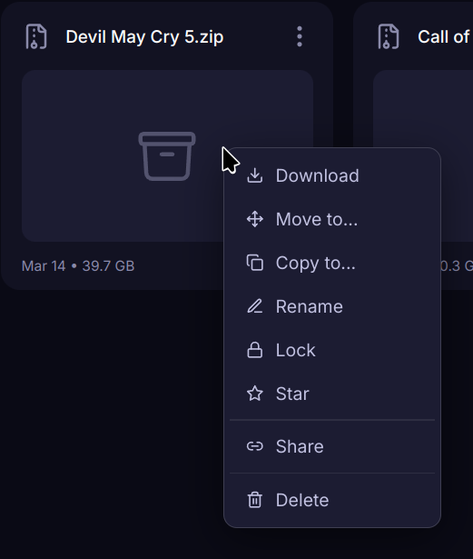
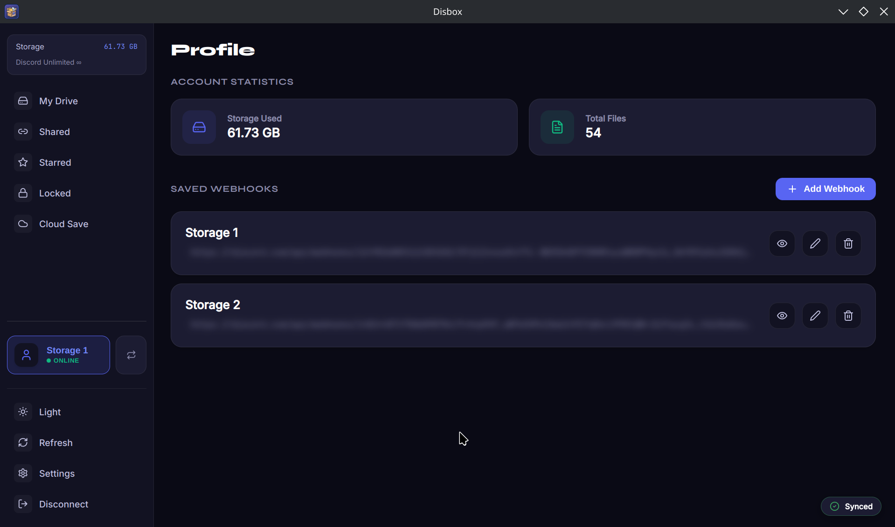
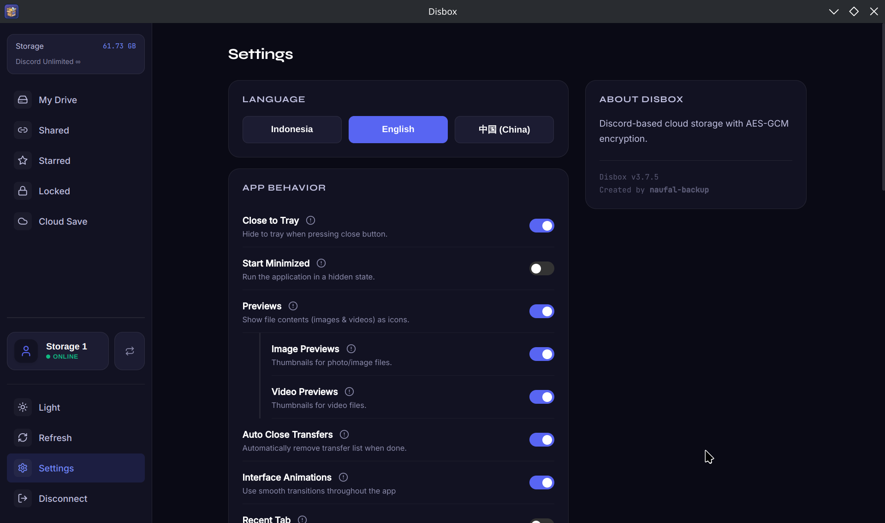
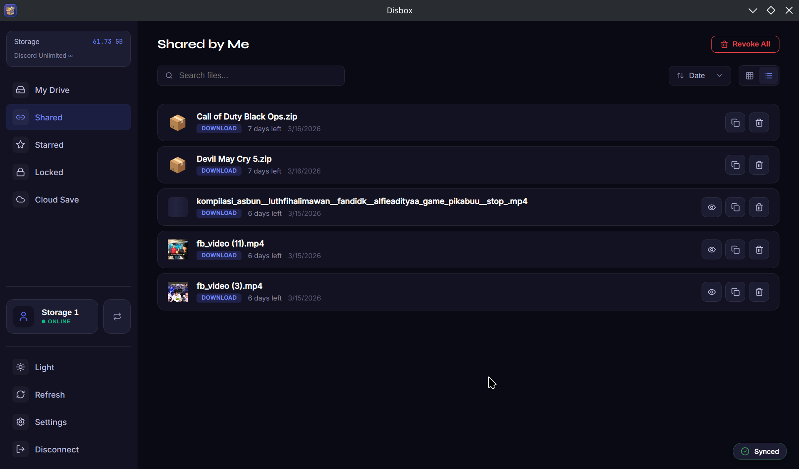
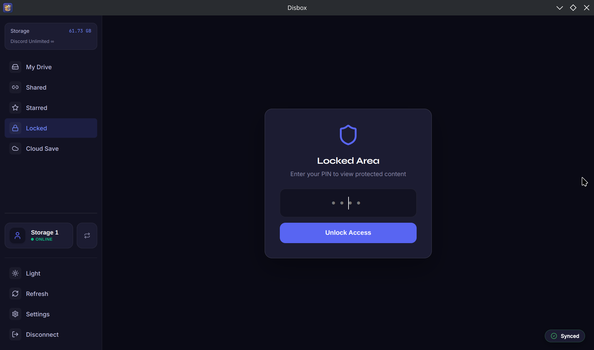

# Disbox ⬡

Disbox adalah aplikasi desktop penyimpanan awan (cloud storage) modern yang memanfaatkan Discord sebagai media penyimpanan tak terbatas. Dibangun dengan **Electron** dan **React**, Disbox menawarkan pengalaman pengelolaan file yang ringan, aman, dan tersedia untuk **Linux** maupun **Windows**.



## 🚀 Fitur Utama

*   **Penyimpanan Tak Terbatas:** Manfaatkan Discord Webhook untuk menyimpan file tanpa batasan kuota.
*   **👤 Manajemen Profil & Account Switcher:** [BARU] Kelola banyak akun drive dengan Nama Alias kustom. Pindah antar akun drive secara instan melalui sistem *badge* profil di sidebar tanpa perlu relogin.
*   **🔒 Keamanan Ganda (App Lock & Master PIN):** [BARU] Selain perlindungan folder dengan Master PIN, kini tersedia **App Lock** berbasis PIN lokal yang mengunci aplikasi setiap kali dibuka untuk privasi maksimal di perangkat fisik.
*   **⚡ Sharing Parallel Worker:** [BARU] Pengunduhan file besar via link share kini **3x lebih cepat** berkat optimasi Cloudflare Worker dengan sistem *parallel chunk fetching*.
*   **📊 Statistik Akun:** [BARU] Pantau total penggunaan ruang penyimpanan dan jumlah file secara real-time di halaman Profil.
*   **Virtual File System:** Kelola file Anda dengan struktur folder, layaknya Google Drive atau Dropbox.
*   **SQLite Engine (Optimized):** Metadata dikelola menggunakan SQLite dengan **WAL (Write-Ahead Logging) Mode** untuk sinkronisasi kilat dan integritas data yang sangat stabil.
*   **Dukungan Multi-Bahasa:** Tersedia dalam bahasa **Indonesia**, **English**, dan **Mandarin (China)** untuk kenyamanan pengguna global.
*   **Cloud Save (Sync Otomatis):** Pantau folder penyimpanan game (game saves) secara real-time dan sinkronisasikan secara otomatis ke Discord. Mendukung ekspor ZIP dan sinkronisasi antar perangkat.
*   **Animasi Antarmuka:** Transisi visual yang halus dan modern menggunakan `framer-motion` (dapat diaktifkan/dimatikan melalui Settings).
*   **Smart Help Bubbles:** Penjelasan detail untuk setiap pengaturan dalam bentuk bubble mengambang cerdas yang menyesuaikan posisi agar tidak terpotong layar.
*   **Validasi Integritas Data:** System pengecekan otomatis untuk mencegah duplikasi nama file/folder di lokasi yang sama.
*   **Enkripsi AES-GCM:** Keamanan tingkat tinggi untuk setiap file dan folder dengan enkripsi *end-to-end* menggunakan kunci yang diturunkan dari URL Webhook Anda.
*   **UI/UX Modern & Responsif:** 
    *   Toolbar terstandarisasi (32px) untuk estetika yang simetris.
    *   Sistem Sorting kustom (Nama, Terbaru, Ukuran).
    *   Smart Breadcrumb yang tetap fungsional di folder sangat dalam.
    *   Context Menu cerdas yang tidak terpotong di pinggir layar.
*   **Sistem Chunking Pintar:** File besar otomatis dipecah menjadi bagian-bagian kecil (10MB - 500MB) sesuai limit akun Discord Anda.
*   **Pratinjau File Langsung:** Dukungan Gambar, Video, Audio, PDF, dan Kode (*Syntax Highlighting*).

## 🌍 Lokalisasi

Disbox mendukung pengaturan bahasa secara dinamis:
- 🇮🇩 **Indonesia** (Default)
- 🇺🇸 **English**
- 🇨🇳 **Mandarin (China)**

Pengaturan dapat diubah kapan saja melalui menu **Settings > Language**.

## 📸 Cuplikan Layar

| Login Page | File Explorer |
|:---:|:---:|
|  |  |

| Document Viewer | Context Menu |
|:---:|:---:|
|  |  |

| Profile Page | Settings Page |
|:---:|:---:|
|  |  |

| Shared by Me | Locked Area |
|:---:|:---:|
|  |  |

## 🛠 Prasyarat

Pastikan sistem Anda memiliki komponen berikut:
*   **Node.js** (v18 atau lebih baru)
*   **npm** atau **yarn**

## ⚙️ Instalasi
   **Automatic Install**
    [Releases](https://github.com/naufal-backup/disbox/releases)
1.  **Kloning repositori ini:**
    ```bash
    git clone https://github.com/naufal-backup/disbox.git
    cd disbox
    ```

2.  **Instal dependensi:**
    *   **Linux:**
        ```bash
        chmod +x setup.sh
        ./setup.sh
        ```
    *   **Windows / Umum:**
        ```bash
        npm install
        ```

## 🖥 Penggunaan

### Mode Pengembangan
Jalankan aplikasi dalam mode pengembangan dengan fitur *hot-reload*:
```bash
npm run dev
```

### Build Aplikasi (Produksi)
Untuk membuat paket aplikasi siap pakai:
```bash
npm run build
```
Hasil build akan tersedia di folder `release/`:
*   **Linux:** `.AppImage` dan `.deb`
*   **Windows:** `.exe` (Setup), Portable, dan `.zip`

## 🔒 Keamanan & Privasi

Disbox menggunakan **Discord Webhook** sebagai endpoint penyimpanan. Data Anda aman karena tidak ada server perantara (serverless). 

**Keamanan PIN:**
*   **Master PIN:** Dienkripsi dan disimpan dalam metadata Discord, memungkinkan sinkronisasi folder terkunci antar perangkat.
*   **App Lock PIN:** Hanya disimpan secara lokal di perangkat Anda (`localStorage`). Digunakan untuk mengunci akses ke aplikasi Disbox secara keseluruhan.

**Penyimpanan Lokal (Optimized):**
Aplikasi menggunakan **SQLite Database** (`disbox.db`) dengan optimasi performa tinggi (**WAL Mode & Synchronous Normal**). Hal ini menjamin proses tulis-baca metadata ribuan file terjadi secara instan.

## 🤝 Kontribusi

Laporan bug dan Pull Request sangat kami hargai!
1. Fork repositori.
2. Buat branch fitur (`git checkout -b fitur-keren`).
3. Commit perubahan (`git commit -m 'Menambah fitur keren'`).
4. Push ke branch (`git push origin fitur-keren`).
5. Buat Pull Request.

## 💡 Terinspirasi

https://github.com/DisboxApp/web

## 💰 Support

https://saweria.co/Naufal453

## 📄 Lisensi

Proyek ini dilisensikan di bawah **MIT License**.

---

**Developed by Naufal Gastiadirrijal Fawwaz Alamsyah**
*   GitHub: [naufal-backup](https://github.com/naufal-backup)
*   LinkedIn: [Naufal Alamsyah](https://www.linkedin.com/in/naufal-gastiadirrijal-fawwaz-alamsyah-a34b43363)
*   Email: naufalalamsyah453@gmail.com
